#Documentation for Project 2 - LEMP-STACK on AWS
- Step 1 -- Setup Servers on AWS 
  
   - `sudo apt-get update && sudo apt-get upgrade` 
   
   -  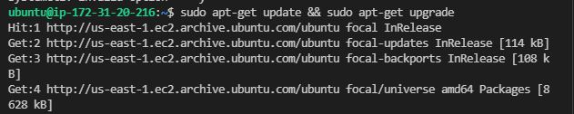
  
   -  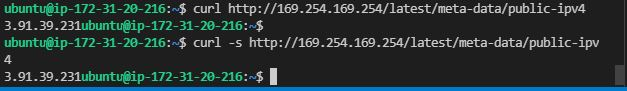
- Step 2 -- Configure Security Groups
- Step 3  
    - c) Install and configure Nginx
      - `sudo apt-get install nginx -y`
      - `sudo systemctl status nginx`
  
      - 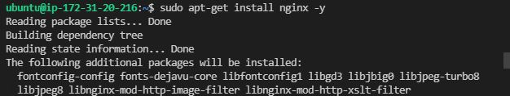
  
      - 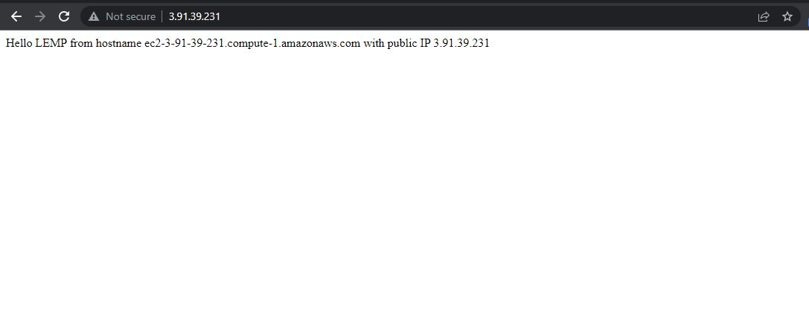
  
      - 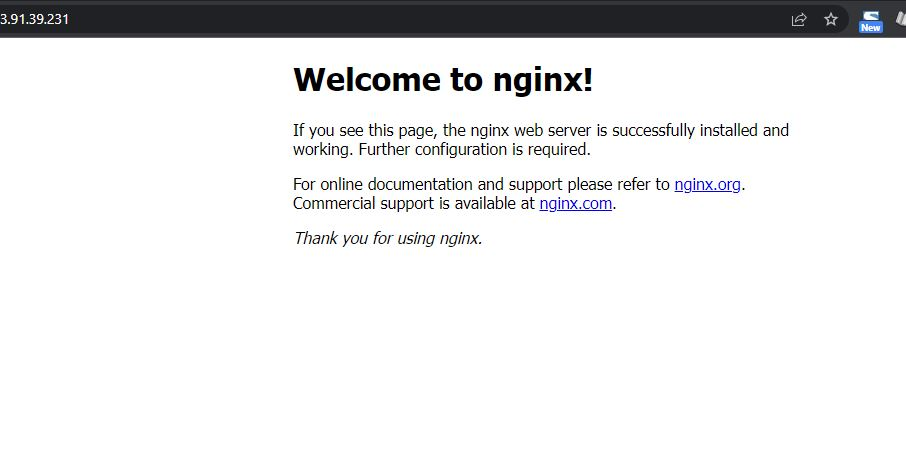
   
    - d) Install and secure MySQL Server
      - `sudo apt-get install mysql-server` 
      - `sudo mysql_secure_installation`
      - `sudo mysql` 
      - `show databases;` 
      - `mysql exit`
  
      - 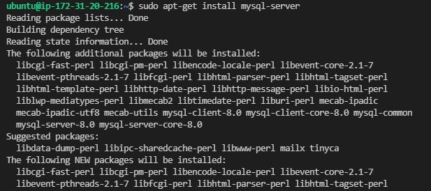
  
      - 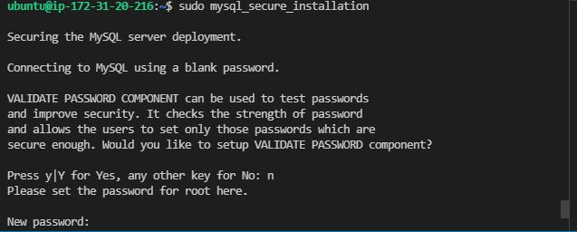
  
      - 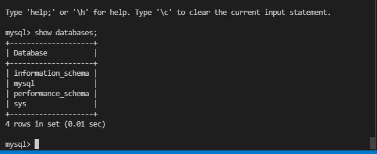
  
    - e) Configure PHP and Nginx 
        ```
        sudo apt-get install php-fpm php-mysql 
        sudo mkdir /var/www/projectLEMP
        sudo chown -R $USER:$USER /var/www/projectLEMP

        sudo nano /etc/nginx/sites-available/projectLEMP

        copy and paste below in the file opened above
        #/etc/nginx/sites-available/projectLEMP
        server {
            listen 80;
            server_name projectLEMP www.projectLEMP;
            root /var/www/projectLEMP;

            index index.html index.htm index.php;

            location / {
                try_files $uri $uri/ =404;
            }

            location ~ \.php$ {
                include snippets/fastcgi-php.conf;
                fastcgi_pass unix:/var/run/php/php7.4-fpm.sock;
            }

            location ~ /\.ht {
                deny all;
            }

        }

        Activate Configuration 
        sudo ln -s /etc/ngnix/sites-available/projectLemp/etc
        /nginx/sites-enables

        Test configuration 

        sudo nginx -t 
        --- should return message configuration okay 

        Disable default nginx host 
        sudo unlink /etc/nginx/sites-enabled/default 

        Reload Nginx Server 
        sudo systemctl reload nginx 
        Create an html file verify server block works properly
 
        sudo echo 'Hello LEMP from hostname' 
        $(curl -s http://169.254.169.254/latest/meta-data/public-hostname) 
        'with public IP' $(curl -s http://169.254.169.254/latest
        /meta-data/public-ipv4) > /var/www/projectLEMP/index.html

        Confirm using pUblic IP address of instance
        https://public-dns-name:80
        https://public ec2 ip address:80

        Testing php with nginx 
        sudo nano /var/www/projectLEMP/info.php
        enter code below into file 

        <?php
        phpinfo();

        Access page 
        https://public-dns-name| public ip address/info.php

        Remove PHP test page
        sudo rm /var/www/projectLEMP/info.php
        ```
      - 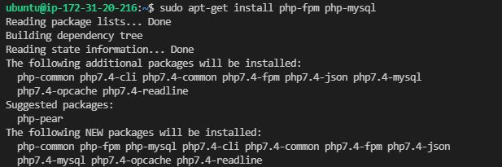
  
      - 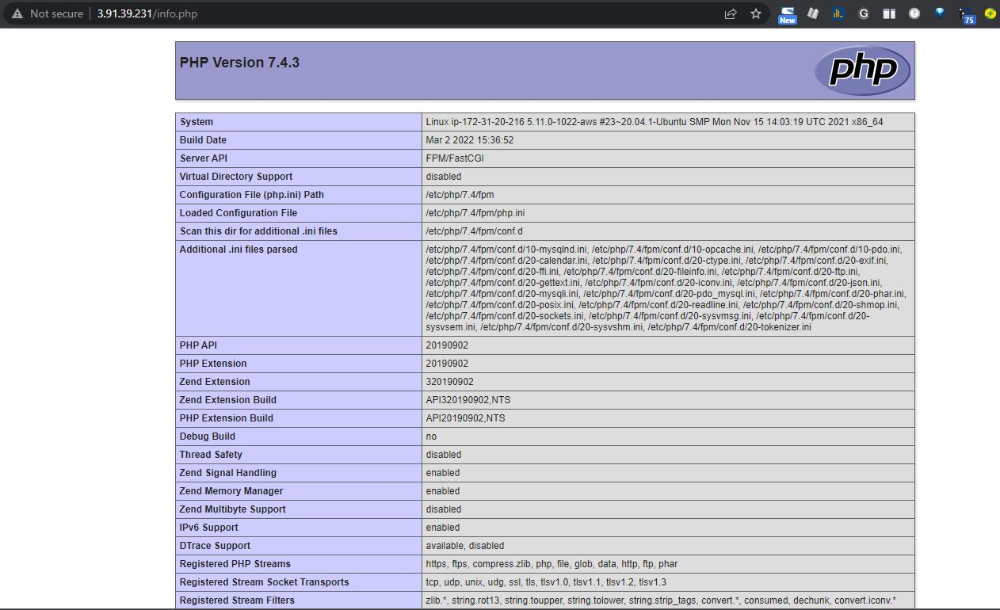
  
    - f) Create a new user, secure it with password and a database to contain values for the todo list
       ```
        Connect to your MySQL DB, create a user, db
        sudo mysql

        CREATE DATABASE `example_database`;

        CREATE USER 'example-user'@'%' IDENTIFIED WITH mysql_native_password BY 'password';

        Create a user and secure the database
        GRANT ALL ON example_database.* TO 'example-user'@'%';

        exit 

        mysql -u example-user  -p 'password'

        SHOW DATABASES;

        Create new table to store data in
        CREATE TABLE example_database.todo_list (
        item_id INT AUTO_INCREMENT,
        content VARCHAR(255),
        PRIMARY KEY(item_id)
        );

        Insert values into database
        INSERT INTO example_database.todo_list (content) VALUES ("My first important item");
        INSERT INTO example_database.todo_list (content) VALUES ("My second important item");
        INSERT INTO example_database.todo_list (content) VALUES ("My third important item");
        INSERT INTO example_database.todo_list (content) VALUES ("My fourth important item");
        INSERT INTO example_database.todo_list (content) VALUES ("My fifth important item");

        SELECT * FROM example_database.todo_list;
        exit
       ```

      - 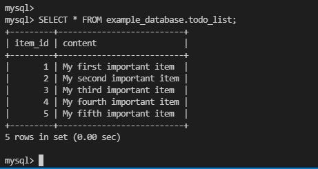
    - g) Create Crud Application to pull data from the database that was setup above using php
        ```
        nano /var/www/projectLEMP/todo_list.php

        enter code below into file created -- pulls data into a table

        <?php
        $user = "peter";
        $password = "asulikit44";
        $database = "example_database";
        $table = "todo_list";
      
        try {
        $db = new PDO("mysql:host=localhost;dbname=$database", $user, $password);
        echo "<h2>TODO</h2><ol>";
        foreach($db->query("SELECT content FROM $table") as $row) {
            echo "<li>" . $row['content'] . "</li>";
        }
        echo "</ol>";
        } catch (PDOException $e) {
            print "Error!: " . $e->getMessage() . "<br/>";
            die();
        }
    
        Verify Project
        http://<Public_domain_or_IP>/todo_list.php
        ```

    - 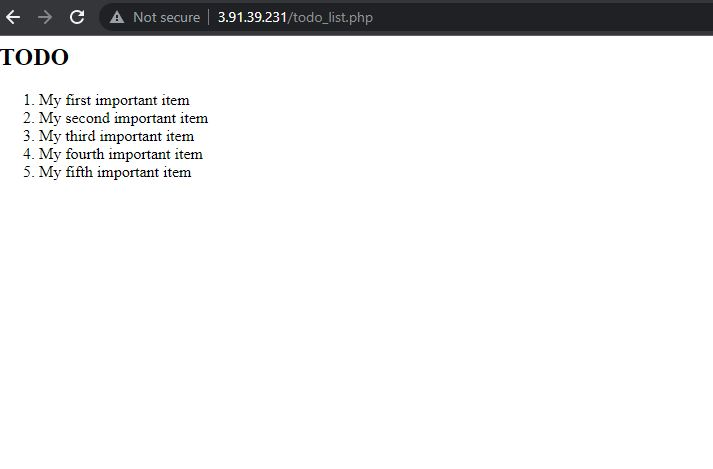


